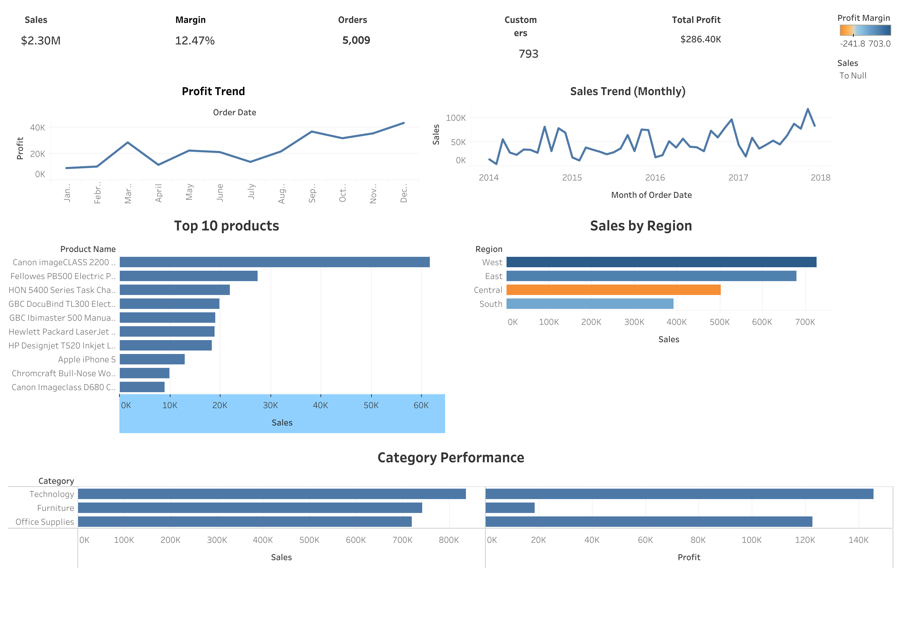

# 📈 Sales Performance & KPI Dashboard (Tableau)

This project visualizes sales and profit performance using the popular **Superstore dataset**.  
The dashboard highlights key business KPIs, trends, regional performance, and top-selling products.

🔗 **Live Dashboard (Tableau Public):**  
[Sales Performance Dashboard](https://public.tableau.com/app/profile/svara.masurekar/viz/SalesKPIdashboard_17633792786950/Dashboard1?publish=yes)

---

## 🛠 Tools Used

- **Python (pandas)** – Data cleaning & preprocessing  
- **Tableau Public** – Dashboard creation  
- **GitHub** – Documentation & project hosting  

---

## 📊 Dataset

This project uses the **Superstore sales dataset**, which includes:

- Orders  
- Sales  
- Profit  
- Region & Geography  
- Customer & Segment  
- Product Categories  
- Shipping information  

The dataset was cleaned and enhanced with:

- Year  
- Month  
- Month Name  
- Profit Margin  
- AOV (Average Order Value)  

---

## 🧹 Data Cleaning (Python Notebook)

The cleaning steps included:

- Converting date columns  
- Removing duplicates  
- Fixing column names  
- Handling missing values  
- Creating new features  
  - `year`, `month`, `month_name`  
  - `profit_margin`  
  - `aov`  

The cleaned file is saved as:`superstore_clean.csv`

---

## 📈 Dashboard Overview

The Tableau dashboard includes the following components:

### **1️⃣ KPI Cards**
- Total Sales  
- Total Profit  
- Profit Margin %  
- Total Orders  
- Total Customers  

### **2️⃣ Sales Trend (Month-wise)**
A line chart visualizing sales across time.

### **3️⃣ Sales by Region**
A bar chart comparing regional performance.

### **4️⃣ Category Performance**
Sales and profit comparison across product categories.

### **5️⃣ Top 10 Products**
A ranked bar chart showing best-selling products.

---

## 🖼 Dashboard Screenshot

---

## 🔍 Key Insights

- Sales peak near end-of-year across multiple segments.  
- West and East regions contribute the largest share of revenue.  
- Technology category is the highest performing vertical.  
- Profit margin varies significantly across product sub-categories.  

